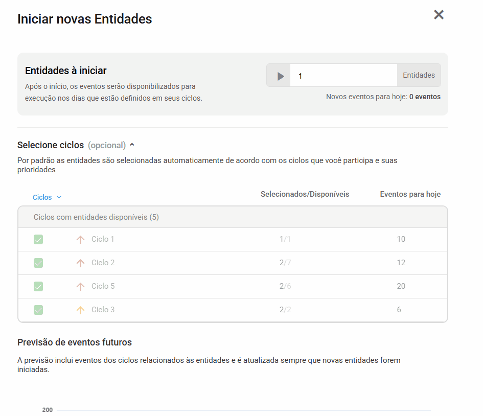

# EventProjectionApp

EventProjectionApp is a modern Angular application focused on event forecasting, using Angular 19+ with the latest best practices.

---

## 📚 Tech Stack

- **Angular 19 (Standalone Components + Signals)**
- **Angular Material** (UI components library)
- **ECharts** (Graph library for event projection charts)
- **Atomic Design Architecture** (Organisms / Pages)
- **State Management with Signals**
- **Clean Code, SOLID, KISS principles**
- **State-driven navigation (`showSplash`) instead of Router**

---

## 🗂 Project Structure

src/  
├── app/  
│   ├── core/         # Signals, Services, Models, Utils, Mocks  
│   └── presentation/ # Components (Organisms) and Pages  
├── assets/            # Images and SplashScreen  
└── styles.scss        # Global SCSS utilities

---

## 🚀 Getting Started

**Install Dependencies:**  
yarn install

**Run the Development Server:**  
yarn start

After starting the server, access the app at:  
http://localhost:4200

---

## ⚡ Features

- **SplashScreen Control:** Splash appears on startup and disappears after 3 seconds automatically.
- **State Management with Signals:** Entire cycles and event projections are managed reactively.
- **Clean Architecture:** UI separated from services and business logic.
- **Graphs with ECharts:** Fully customized stacked bar charts.

---

## 📜 Technical Decisions

- **Angular Material** was chosen for UI consistency, simplicity, and ease of theme adaptation.
- **ECharts** was chosen for its flexibility, performance, and capability to render complex stacked bar charts with minimal overhead.
- **SplashScreen** implemented using a `showSplash` boolean state, avoiding router complexity.
- **CSS Optimization:** Due to a visual library change during development (Material Template to direct ECharts integration), global SCSS utilities were introduced incrementally, ensuring visual consistency without breaking existing layouts.
- **Future Improvements:** Full migration to SCSS utility classes across all components to increase maintainability and scalability.

---

## 📷 Application Preview

---

## 🛠 Available Scripts

| Command      | Purpose                          |
|:-------------|:----------------------------------|
| yarn start   | Run the development server        |
| yarn build   | Build the project for production  |
| yarn test    | Run unit tests                    |

---

## 📚 Further Resources

- [Angular Standalone Components](https://angular.dev/guide/standalone-components)
- [Angular Signals Overview](https://angular.dev/guide/signals)
- [SCSS Modern Patterns](https://sass-lang.com/)
- [ECharts Documentation](https://echarts.apache.org/)

---
